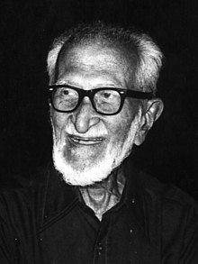

<table class="infobox biography vcard">
<tbody>
<tr>
<th colspan="2">

Salim Ali

</th>
</tr>
<tr>
<td colspan="2"></td>
</tr>
<tr>
<th scope="row">Born</th>
<td>12 November 1896 

<a title="Mumbai" href="https://en.wikipedia.org/wiki/Mumbai">Bombay</a>,&nbsp;<a title="Bombay Presidency" href="https://en.wikipedia.org/wiki/Bombay_Presidency">Bombay Presidency</a>,&nbsp;<a class="mw-redirect" title="British India" href="https://en.wikipedia.org/wiki/British_India">British India</a>

</td>
</tr>
<tr>
<th scope="row">Died</th>
<td>20 June 1987&nbsp;(aged&nbsp;90) 

<a title="Mumbai" href="https://en.wikipedia.org/wiki/Mumbai">Bombay</a>,&nbsp;<a title="Maharashtra" href="https://en.wikipedia.org/wiki/Maharashtra">Maharashtra</a>,&nbsp;<a title="India" href="https://en.wikipedia.org/wiki/India">India</a>

</td>
</tr>
<tr>
<th scope="row">Nationality</th>
<td class="category"><a title="India" href="https://en.wikipedia.org/wiki/India">Indian</a></td>
</tr>
<tr>
<th scope="row">Spouse(s)</th>
<td>Tehmina Ali</td>
</tr>
<tr>
<th scope="row">Awards</th>
<td><a title="Padma Bhushan" href="https://en.wikipedia.org/wiki/Padma_Bhushan">Padma Bhushan</a>&nbsp;(1958) 

<a title="Padma Vibhushan" href="https://en.wikipedia.org/wiki/Padma_Vibhushan">Padma Vibhushan</a>&nbsp;(1976)

<a title="J. Paul Getty Award for Conservation Leadership" href="https://en.wikipedia.org/wiki/J._Paul_Getty_Award_for_Conservation_Leadership">J. Paul Getty Award for Conservation Leadership</a>&nbsp;(1975)</td>
</tr>
<tr>
<td colspan="2"><strong>Scientific career</strong></td>
</tr>
<tr>
<th scope="row">Fields</th>
<td class="category"><a title="Ornithology" href="https://en.wikipedia.org/wiki/Ornithology">Ornithology</a> <a title="Natural history" href="https://en.wikipedia.org/wiki/Natural_history">Natural history</a></td>
</tr>
</tbody>
</table>
 

<strong>S&aacute;lim Moizuddin Abdul Ali</strong>&nbsp;(12 November 1896&nbsp;&ndash; 20 June 1987)&nbsp;was an&nbsp;<a title="India" href="https://en.wikipedia.org/wiki/India">Indian</a>&nbsp;<a class="mw-redirect" title="Ornithologist" href="https://en.wikipedia.org/wiki/Ornithologist">ornithologist</a>&nbsp;and&nbsp;<a title="Natural history" href="https://en.wikipedia.org/wiki/Natural_history">naturalist</a>. Sometimes referred to as the "<em>Birdman of India</em>", Salim Ali was the first Indian to conduct systematic bird surveys across India and wrote several&nbsp;<a class="mw-redirect" title="Bird books" href="https://en.wikipedia.org/wiki/Bird_books">bird books</a>&nbsp;that popularized&nbsp;<a title="Ornithology" href="https://en.wikipedia.org/wiki/Ornithology">ornithology</a>&nbsp;in India. He became a key figure behind the&nbsp;<a title="Bombay Natural History Society" href="https://en.wikipedia.org/wiki/Bombay_Natural_History_Society">Bombay Natural History Society</a>&nbsp;after 1947 and used his personal influence to garner government support for the organisation, create the Bharatpur bird sanctuary (<a title="Keoladeo National Park" href="https://en.wikipedia.org/wiki/Keoladeo_National_Park">Keoladeo National Park</a>) and prevent the destruction of what is now the&nbsp;<a title="Silent Valley National Park" href="https://en.wikipedia.org/wiki/Silent_Valley_National_Park">Silent Valley National Park</a>. Along with&nbsp;<a title="Sidney Dillon Ripley" href="https://en.wikipedia.org/wiki/Sidney_Dillon_Ripley">Sidney Dillon Ripley</a>&nbsp;he wrote the landmark ten volume&nbsp;<em><a title="Handbook of the Birds of India and Pakistan" href="https://en.wikipedia.org/wiki/Handbook_of_the_Birds_of_India_and_Pakistan">Handbook of the Birds of India and Pakistan</a></em>, a second edition of which was completed after his death. He was awarded the&nbsp;<a title="Padma Bhushan" href="https://en.wikipedia.org/wiki/Padma_Bhushan">Padma Bhushan</a>&nbsp;in 1958 and the&nbsp;<a title="Padma Vibhushan" href="https://en.wikipedia.org/wiki/Padma_Vibhushan">Padma Vibhushan</a>&nbsp;in 1976, India's third and second highest civilian honours respectively.&nbsp;Several species of birds, a couple of bird sanctuaries and institutions have been named after him.

 

<h2> Books </h2>
<ul>

                             

 <li><a target="_blank" href="https://github.com/manjunath5496/Salim-Ali-Books/blob/master/ali(1).pdf" style="text-decoration:none;">Handbook of the Birds of India and Pakistan: Together with Those of Bangladesh, Nepal, Bhutan and Sri Lanka: Volume 2</a></li>

 <li><a target="_blank" href="https://github.com/manjunath5496/Salim-Ali-Books/blob/master/ali(2).pdf" style="text-decoration:none;">Handbook of the Birds of India and Pakistan: Together with Those of Bangladesh, Nepal, Bhutan and Sri Lanka: Volume 4</a></li>

<li><a target="_blank" href="https://github.com/manjunath5496/Salim-Ali-Books/blob/master/ali(3).pdf" style="text-decoration:none;">Handbook of the Birds of India and Pakistan: Together with Those of Bangladesh, Nepal, Bhutan and Sri Lanka: Volume 5</a></li>
 <li><a target="_blank" href="https://github.com/manjunath5496/Salim-Ali-Books/blob/master/ali(4).pdf" style="text-decoration:none;">Handbook of the Birds of India and Pakistan: Together with Those of Bangladesh, Nepal, Bhutan and Sri Lanka: Volume 6</a></li>                              
<li><a target="_blank" href="https://github.com/manjunath5496/Salim-Ali-Books/blob/master/ali(5).pdf" style="text-decoration:none;">Handbook of the Birds of India and Pakistan: Together with Those of Bangladesh, Nepal, Bhutan and Sri Lanka: Volume 7</a></li>
<li><a target="_blank" href="https://github.com/manjunath5496/Salim-Ali-Books/blob/master/ali(6).pdf" style="text-decoration:none;">Handbook of the Birds of India and Pakistan: Together with Those of Bangladesh, Nepal, Bhutan and Sri Lanka: Volume 9</a></li>
 <li><a target="_blank" href="https://github.com/manjunath5496/Salim-Ali-Books/blob/master/ali(7).pdf" style="text-decoration:none;">The Book of Indian Birds </a></li>

 <li><a target="_blank" href="https://github.com/manjunath5496/Salim-Ali-Books/blob/master/ali(8).pdf" style="text-decoration:none;"> A Pictorial Guide to Birds of the Indian Subcontinent</a></li>
   <li><a target="_blank" href="https://github.com/manjunath5496/Salim-Ali-Books/blob/master/ali(9).pdf" style="text-decoration:none;">Handbook of the Birds of India and Pakistan: Together with Those of Bangladesh, Nepal, Bhutan and Sri Lanka: Volume 1 [Part I]</a></li>
  
   
 <li><a target="_blank" href="https://github.com/manjunath5496/Salim-Ali-Books/blob/master/ali(10).pdf" style="text-decoration:none;">Handbook of the Birds of India and Pakistan: Together with Those of Bangladesh, Nepal, Bhutan and Sri Lanka: Volume 1 [Part II]</a></li> 

</ul>
